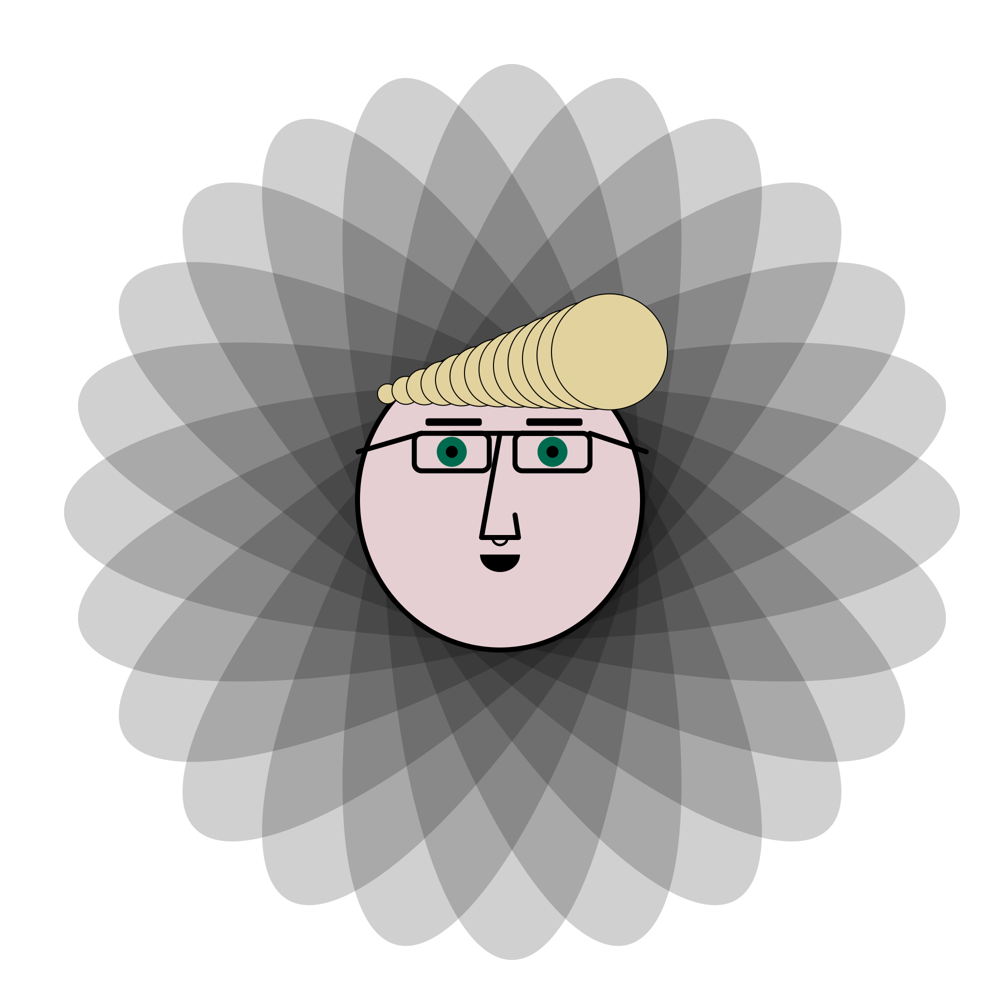

## NHO Quest III Challenge IV Creative Exercise
To embody the High-Impact Behavior **Work To Learn**, I'm teaching myself how to draw images in Go. I'll be drawing a self-portrait using the [Go Graphics module](https://github.com/fogleman/gg).

## Output:
